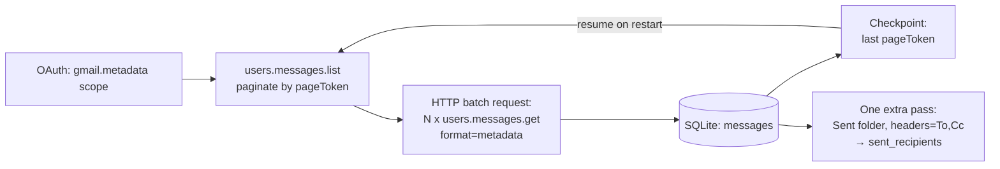
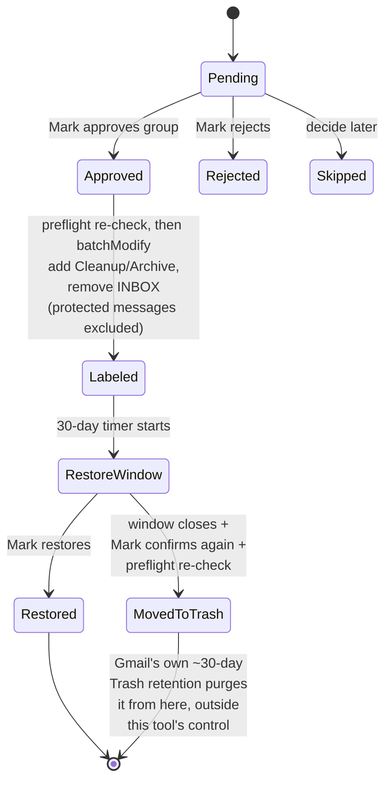

# Gmail Cleanup Strategy — Technical Spec

2026-09-20 · @Someone · v9 (adds the missing `sent_recipients` table — caught by Codex before extract/ was built against the gap — and documents why it needs no checkpoint of its own)

## Overview

Mark's Gmail account holds 412,847 messages (61.2 GB) collected since August 2005, now billed under Google's storage pricing. The goal is a cleanup tool that ranks senders from safest to riskiest to delete and lets Mark approve every batch himself — nothing is ever auto-deleted.

Deletion is also staged, not immediate: an approved batch is labeled and archived first, with a 30-day restore window before anything moves toward final deletion. Every safety-relevant action is written to an audit log before it runs.

**v1 scope:** a one-time cleanup pass over the existing mailbox. Ongoing/incremental sync (catching mail that arrives after the initial pull) is explicitly out of scope for v1 — see **Future work** at the end.

## Build split

**Claude is the architect; Codex is the implementation owner.** This replaces the earlier component-by-component code split: one engineer owns the complete codebase so the shared database contract, safety controls, and integration behavior cannot drift across independently built streams.

| Area | Claude — architect | Codex — engineer |
| --- | --- | --- |
| Technical spec | Owns decisions, guardrails, state model, and acceptance criteria | Flags implementation conflicts and keeps code aligned with the approved spec |
| `db/` | Approves the schema and migration contract | Implements, tests, and versions the shared module first |
| `extract/` | Defines Gmail-data and privacy constraints | Implements and tests metadata extraction |
| `score/` | Owns taxonomy, rules, thresholds, and LLM policy | Implements categorization, aggregation, and scoring |
| `execute/` | Owns irreversible-action safety requirements | Implements preflight, archive, restore, Trash flow, retries, and audit logging |
| `review-ui/` | Approves workflow, copy, and design intent | Implements the local backend, API, frontend, and UI tests |
| Integration | Reviews milestones and resolves newly discovered design decisions | Runs integration tests and fixes contract mismatches |

**Testing responsibility is three-way, and this is what actually closes each review gate below — not just "Claude reviews":**
- **Codex** writes and runs unit tests per component (fixture-based schema tests for `db/`, extraction/scoring fixtures, UI tests, integration tests) as part of building each milestone.
- **Claude** runs supplemental testing during code review — the things unit tests tend to miss: edge cases, and specifically verifying the safety rails in this spec (preflight ordering, the `original_labels` NULL-guard, fail-closed label resolution, the confirmation-snapshot check, etc.) are actually implemented as specified, not just that the code runs.
- **Mark**, as product owner, manually tests the feature/functionality itself once Codex's and Claude's checks pass — this is the actual acceptance step that closes a gate and clears the next milestone to start.

**Implementation order and review gates:**

1. Codex implements `db/`, including migrations and fixture-based schema tests.
2. Claude reviews the schema against this spec; Mark accepts before it's locked.
3. Codex implements `extract/`, then `score/`, each with fixture-based tests; Claude reviews, Mark accepts each before the next starts.
4. Codex builds `review-ui/` against the real schema; same review-then-accept gate.
5. Codex implements `execute/` last, with dry-run as the first acceptance path; same gate.
6. **No Gmail live action occurs until Mark has manually tested the complete dry-run path and explicitly accepted it** — the one gate that isn't allowed to be implicit.

## Local architecture

*(Pre-implementation question: a browser-only UI cannot read a local SQLite file or launch `execute/run.py` — this has to be resolved before `review-ui/` can be built.)*

**review-ui is a local Python backend (FastAPI/Flask) plus the browser frontend it serves — not a pure static page, and not an Electron/Tauri desktop app.**

- The backend runs on localhost only (e.g. `127.0.0.1:8765`), started by Mark (a script or double-clickable launcher), which opens his default browser to it.
- It is the **only** thing that touches the database on the UI side — the frontend calls its local HTTP API; it never opens the SQLite file itself. This is what makes the read/write list in **Integration contract** enforceable rather than aspirational.
- It also invokes `execute/run.py` as a subprocess when Mark clicks "Confirm and start archive run" / "Confirm permanent deletion" — Mark can alternatively run `execute/` manually via CLI at any time; both paths are supported.
- This avoids desktop-app packaging entirely: the whole tool is Python + a browser tab. It also means review-ui's backend can import the same `db/` schema/migration module that `extract/`, `score/`, and `execute/` use, so there is exactly one definition of the database shape.
- Codex is free to build the frontend in whatever framework it prefers (plain JS, React, etc.) — it's served as static assets by the same local backend. The backend/API boundary is what's load-bearing here, not the frontend's tech stack.

## OAuth scope strategy (why there's no `https://mail.google.com/` anywhere in this design)

*(Pre-implementation blocker: Gmail's `batchDelete` requires the full-account `https://mail.google.com/` scope — `gmail.modify` explicitly excludes "immediate, permanent deletion... bypassing Trash." Requesting full-account access — mail, everything — just to reclaim storage is a large, avoidable privilege escalation.)*

**Redesign: "final deletion" is accomplished by moving messages into Gmail's own Trash, not by calling `batchDelete`.** Concretely, once Mark gives the second confirmation, `execute/` calls `users.messages.batchModify` with `addLabelIds=['TRASH']` (removing `Cleanup/Archive`) — an operation `gmail.modify` fully covers. Gmail's own Trash then auto-purges on its own ~30-day retention, outside this tool's control or visibility, which is what performs the actual, final, unrecoverable removal.

Consequences, all treated as intentional in the rest of this document:

- The tool never requests more than `gmail.metadata` (extraction) and `gmail.modify` (labeling/archiving/trashing) — no full-account scope, ever.
- There are now, in effect, **two** waiting periods before data is truly gone: this tool's 30-day restore window (fully under Mark's control, restorable via `original_labels`), followed by Gmail's own ~30-day Trash retention (native Gmail recovery, outside this tool but still a real safety margin). This is strictly safer than the original single-window design, as a side effect of choosing the narrower scope, not the goal in itself.
- Mark's second confirmation still gates this tool's own action (the move-to-Trash `batchModify` call) — "permanent deletion is never automatic" remains true about what *this tool* does. What Gmail does afterward, on its own schedule, is inherently automatic and outside this tool's control, exactly like any other item a person trashes in Gmail normally.
- Internally, `batches.status`/`audit_log.event` use `trashed`/`moved_to_trash` rather than `permanently_deleted`, since that's what the tool actually causes and can verify; user-facing copy can still say "permanent deletion" for the button/flow, since that's the outcome Mark intends and will experience, with the mechanism explained in the confirmation text.
- If Mark ever specifically wants immediate, Gmail-Trash-bypassing deletion, that requires requesting the separate, broader `https://mail.google.com/` scope as an explicit, narrowly-used step — see **Future work**. It is not part of v1.

## Data schema

Metadata only — never message bodies — pulled once and stored locally in SQLite at `data/gmail_cleanup.db`. Schema and migrations live in a shared `db/` module (`schema.sql` + a small sequential migration runner + `schema_version` table) imported by every one of `extract/`, `score/`, `execute/`, and review-ui's backend — see **Integration contract** for why a shared module matters once two separate processes touch the same file.

**`messages`**

| Column | Type | Notes |
| --- | --- | --- |
| message\_id | text (PK) | Gmail message id |
| thread\_id | text | groups replies in a thread |
| sender\_email | text | full From address |
| sender\_domain | text | derived; a message always has exactly one sender domain (grouping ambiguity only arises at the `sender_groups` level — see Grouping) |
| subject | text | |
| date | integer | epoch, from the Date header |
| size\_bytes | integer | |
| is\_read | boolean | |
| is\_starred | boolean | |
| has\_attachment | boolean | |
| has\_list\_unsubscribe | boolean | derived from `List-Unsubscribe` / `List-ID` headers — needed by the categorizer |
| labels | text | JSON array of Gmail label ids **at extraction time** — treated as historical/reference data only; execution never trusts this column for its protected-message check or its restore snapshot (see Review workflow's preflight step) |
| category | text | copied from `sender_identity.category` for this message's `sender_email` |

Because extraction excludes Spam/Trash by default (see Extraction architecture), no row here can carry a live `SPAM` label — that's structural, not a filter applied after the fact.

**`sender_identity`** — the output of the categorization pipeline, one row per unique `sender_email`. This is the cache that makes classification a one-time cost regardless of how many messages a sender has.

| Column | Type | Notes |
| --- | --- | --- |
| sender\_email | text (PK) | |
| sender\_domain | text | |
| category | text | from the fixed 6-category taxonomy (see Scoring model) |
| category\_source | text | `rule` \| `llm` \| `fallback` |
| inferred\_brand | text, nullable | normalized display identity used for grouping (e.g. "Delta Air Lines"); only populated when `brand_source = 'llm'` |
| is\_esp\_routed | boolean, nullable | true if `sender_domain` is third-party sending infrastructure rather than the brand's own domain |
| brand\_source | text | `llm` (Stage 2 ran) \| `not_applicable` (consumer-domain address, brand normalization isn't used for grouping) \| `skipped_offline` (Stage 2 disabled — see Categorization) |
| rationale | text | one-line plain-language explanation, surfaced in Group Review as the "why" |
| model\_version | text, nullable | which model/version produced this row's most recent Stage 2 output, if any |
| classified\_at | integer | |

`category_source` and `brand_source` are tracked independently because they genuinely can differ for the same sender — a rule can confidently decide `category` while `inferred_brand` still needs an LLM call, or vice versa. See **Categorization & identity pipeline** for exactly when each stage runs.

**`sender_groups`**

Approvals happen at this level.

| Column | Type | Notes |
| --- | --- | --- |
| group\_key | text (PK) | composite: `{group_type}:{normalized_key}` — see Grouping for why a bare key isn't safe |
| group\_type | text | `address` \| `domain` \| `brand` |
| domains | text | JSON array of every distinct `sender_domain` among the group's members — one entry for `address`/`domain`-type groups, potentially several for a `brand`-type group whose mail arrives via more than one ESP domain |
| category | text | for `domain`/`brand`-type groups, the most conservative category among member addresses (see Categorization) |
| message\_count | integer | |
| total\_size\_bytes | integer | |
| first\_seen | integer | |
| last\_seen | integer | |
| avg\_date | integer | epoch average of member messages' `date` — feeds `age_weight` |
| pct\_unread | real | |
| pct\_attachments | real | |
| pct\_starred | real | |
| has\_protected\_label | boolean | true if any member message carried a label resolved via `label_map` into the configured protected-label set, as of extraction (see Config). This is a **ranking/display signal only** — it does not gate approval; see the UI/UX section for why only Business-critical locks the Dashboard row, and Review workflow's preflight step for the live re-check that actually protects messages at execution time. |
| delete\_safety\_score | real | computed, see Scoring model |
| approval\_status | text | pending / approved / rejected / skipped |

**`group_members`** — the mapping a bare `group_key` string can't safely encode on its own, and the mechanism review-ui uses to fetch a group's sample messages (see Grouping and Integration contract).

| Column | Type | Notes |
| --- | --- | --- |
| group\_key | text | FK → `sender_groups.group_key` |
| sender\_email | text | FK → `sender_identity.sender_email` |

Primary key `(group_key, sender_email)`. Built in the same aggregation pass that builds `sender_groups`.

**`label_map`** — resolves the human-readable label names this tool needs into actual Gmail label ids, since only system labels (`STARRED`, `IMPORTANT`, etc.) have ids that equal their name; custom labels (e.g. "Family") don't. **Two different resolution policies apply, depending on who owns the label:**

| Column | Type | Notes |
| --- | --- | --- |
| label\_name | text (PK) | as configured, e.g. `STARRED`, `Family`, `Legal/Taxes`, `Cleanup/Archive` |
| label\_id | text | resolved (or created) via the Gmail labels API |
| resolved\_at | integer | |

- **`PROTECTED_LABELS` (Mark's own labels — `STARRED`, `IMPORTANT`, and any custom names he configures):** *resolve-only, fail closed.* Looked up via `users.labels.list` at `extract`/`score` startup (read-only, works under `gmail.metadata`). If a configured name doesn't resolve to an existing label, the tool refuses to start rather than silently running without that protection — these are labels Mark is expected to already have, so a miss almost always means a typo or a label he hasn't actually created, and auto-creating a "protected" label that starts empty would defeat its purpose while masking the mistake.
- **`Cleanup/Archive` (a tool-managed label, not Mark's):** *resolve-or-create.* Checked via `users.labels.list` and created via `users.labels.create` if missing, at `execute/`'s own startup — this is the natural place for it, since creating a label needs write access (`gmail.modify`), which `extract`/`score` never hold and `execute/` only obtains once Mark approves the first batch. Nothing is authorized to fail closed on a label the tool itself is responsible for provisioning.

**`run_state`** — extraction checkpoint for the **main inbox pull only**: last successful `pageToken`, message count, timestamp. Lets a crashed pull resume instead of restarting. (It's a single-row table by design — see `sent_recipients` below for why the Sent-folder pass doesn't need a second one.)

**`sent_recipients`** — the persisted form of the Sent-folder pass's output. This table was missing from v8: `score/` runs as a separate process/invocation after extraction, so the two-way-correspondence set built during the Sent-folder pass has to be durable, not an in-memory value that only existed for the lifetime of the extraction run.

| Column | Type | Notes |
| --- | --- | --- |
| recipient\_email | text (PK) | **lowercased** before storage — see matching note below |

- Populated via `INSERT OR IGNORE INTO sent_recipients (recipient_email) VALUES (?)` for every address parsed out of the Sent-folder pass's `To`/`Cc` headers (a message can have several), lowercased first.
- **`score/`'s Rule 1 check must also lowercase `sender_email` before comparing** (`... WHERE recipient_email = lower(sender_email)`) — Gmail headers can present the same address in different casing, and an unnormalized comparison would silently and non-obviously break the two-way-correspondence signal for any address where casing happens to differ between the Sent header and the inbox `From` header.
- No foreign key to `sender_identity` or `messages`, deliberately: an address Mark sent to may never have sent him anything back, so this set is intentionally independent of whatever extraction found in the inbox.
- **No separate checkpoint needed for the Sent-folder pass.** Because every insert is idempotent (`INSERT OR IGNORE` on a primary key), restarting the whole Sent-folder pass from scratch after a crash is safe and cheap — it just re-inserts addresses already present as no-ops. This is why `run_state` stays a single-row table rather than needing to track two independent pull positions: a full Sent-folder pull is typically far smaller than the 412k-message inbox pull it runs alongside, so the cost of occasionally redoing it from scratch is low, and doing so is always correct rather than merely "probably fine."

**`batches`** — one row per approved group's execution lifecycle. `approval_status` above only covers the review phase; this is what the state machine in Review workflow actually tracks.

| Column | Type | Notes |
| --- | --- | --- |
| batch\_id | text (PK) | uuid |
| group\_key | text | FK → `sender_groups.group_key` |
| status | text | approved / labeling / labeled / restore\_window / restored / trashed / failed (`delete_pending` is a *computed* state, not stored here — see Review workflow) |
| approved\_at | integer | |
| labeled\_at | integer | |
| restore\_deadline | integer | `labeled_at` + 30 days |
| restored\_at | integer, nullable | |
| permanent\_delete\_confirmed\_at | integer, nullable | second, separate confirmation — gates this tool's move-to-Trash call, see OAuth scope strategy |
| confirmation\_snapshot\_hash | text, nullable | hash of the sorted `batch_messages` id list + `message_count`/`total_size_bytes` at confirmation time — re-checked before the trash-move `batchModify` actually runs; a mismatch invalidates the confirmation (see Review workflow) |
| trashed\_at | integer, nullable | when this tool's own move-to-Trash call succeeded — **not** when Gmail eventually purges Trash, which this tool has no visibility into |
| message\_count | integer | snapshot at approval time |
| total\_size\_bytes | integer | snapshot at approval time |
| window\_extensions | integer, default 0 | count of times Mark pushed out `restore_deadline` |

**`batch_messages`** — per-message execution status, so a crashed `batchModify` run resumes without re-processing, and so restore can be exact.

| Column | Type | Notes |
| --- | --- | --- |
| batch\_id | text | FK → `batches.batch_id` |
| message\_id | text | FK → `messages.message_id` |
| status | text | pending / labeled / excluded\_protected / trashed — **no separate `failed` value.** A chunk that fails to write simply stays at its pre-write status (`pending` for a failed archive attempt, `labeled` for a failed trash-move attempt), which is also exactly the correct resume point on retry — see Review workflow. Batch-level failure is tracked on `batches.status`, not here. |
| original\_labels | text, nullable | JSON array snapshot of the message's **live** `labelIds`, read as part of the preflight step and **committed to the database, in its own transaction, immediately before the archiving `batchModify` call** — and written only when this column is currently `NULL` (`UPDATE ... WHERE original_labels IS NULL`), never overwritten on a retry or during the later Trash move. This ordering and the NULL-guard both matter: without them, a Gmail write that succeeds followed by a local crash before the status update would make a retry's preflight read labels that *already include* `Cleanup/Archive`, silently corrupting the true pre-archive snapshot restore depends on. See Review workflow's preflight sequence. |

`excluded_protected` is a real, expected status — it's how the UI explains "approved 500, but 3 were protected and skipped."

**`audit_log`** — durable record of every safety-relevant action this tool takes, independent of Gmail.

| Column | Type | Notes |
| --- | --- | --- |
| id | integer (PK, autoincrement) | |
| batch\_id | text | FK → `batches.batch_id` |
| event | text | approved / labeled / restored / window\_extended / permanent\_delete\_confirmed / moved\_to\_trash |
| message\_count | integer | how many messages this event touched |
| timestamp | integer | |
| note | text | free text, e.g. the confirmation phrase Mark typed, or "extended +30d" |

## Categorization & identity pipeline

Classification runs **once per unique `sender_email`**, not per message, and is cached in `sender_identity`. At 412k messages the number of *unique senders* is expected to be in the hundreds to low thousands, so this is a one-time, low-volume, offline job — cost and latency are trivial regardless of mailbox size. Every message from that address gets `category` denormalized from its `sender_identity` row.

**Stage 1 — deterministic rules (no API call, no cost).** Evaluated in order, first confident match wins, sets `category_source = 'rule'`:

1. **Personal correspondence** — Mark has sent at least one message *to* that address (see "Two-way correspondence" below). *(Gmail Contacts is deliberately not used — see below.)*
2. **Business-critical** — `sender_domain`/`sender_email` matches the curated allow-list in config (bank, employer, insurance, medical, tax, legal, government, etc.).
3. **Transactional / receipts** — sender local-part matches `order|receipt|invoice|billing|statement|shipping|confirmation`, or subject matches common transactional templates.
4. **Automated notifications** — sender local-part matches `notify|notification|alert|no-?reply|do-?not-?reply|system|updates` and the message has **no** `List-Unsubscribe`/`List-ID` header.
5. **Newsletters / subscriptions** — message has a `List-Unsubscribe`/`List-ID` header, without promo signals.
6. **Marketing / promotional** — has `List-Unsubscribe` **and** matches known ESP sending domains or promo-language subject patterns.

Anything that doesn't hit a confident rule above falls through to Stage 2 for `category`.

**Why Gmail Contacts isn't used for rule 1:** the `gmail.metadata` scope this pipeline runs under doesn't grant People/Contacts API access — that would require a separate OAuth scope and a second consent grant just for this one rule. The Sent-folder signal (below) is also arguably the stronger one: a contact list often includes addresses Mark has never actually corresponded with, where Sent-folder membership means he genuinely emailed them.

**Why there's no "Spam / phishing leftovers" rule or category:** `users.messages.list` excludes `SPAM` and `TRASH` by default, and this pipeline doesn't set `includeSpamTrash=true` — so a message carrying a live `SPAM` label cannot appear in the extracted dataset at all, by construction, not by a filter applied afterward. This is a deliberate scope decision: Spam and Trash both auto-purge on Gmail's own 30-day cycle regardless of what this tool does, so they were never contributing meaningfully to the long-term storage this tool targets. The taxonomy is therefore 6 categories, not 7 (see Scoring model). If Spam/Trash inclusion is ever wanted, see Future work.

**Category vs. brand/ESP inference are two independent tracks, not one blended decision:**

- `category` is decided by Stage 1 alone whenever a rule confidently fires — Stage 2 is never asked to override a confident rule-based category.
- `category` falls to Stage 2 only when no rule fires (`category_source = 'llm'`, or `'fallback'` if Stage 2 is unavailable or returns something invalid).
- `inferred_brand`/`is_esp_routed` are decided by Stage 2 alone, and are requested for **every** sender on a non-consumer domain **regardless** of whether `category` was already confidently decided by a rule — rules have no mechanism for brand normalization, so this lookup runs unconditionally wherever grouping needs it (see Grouping). A sender can have `category_source = 'rule'` and still have `inferred_brand` populated by the same Stage 2 pass: when both are needed, one batched API call returns both; when only brand is needed, the call still just confirms the existing rule-based category rather than asking the model to redecide it.

**Stage 2 — Claude classification (Anthropic API), batched.** For the residual senders (plus brand/ESP inference for any non-consumer-domain sender), send Claude a compact, metadata-only bundle per sender — email, display name, domain, ~10–20 sample subject lines, header flags, volume/date-range stats, the two-way-correspondence flag — batching many senders (e.g. 20–50) into each request. A small, fast model is the right size for this task; it's classification over short structured text, not open-ended generation. Ask it to return, per sender: `category` (validated against the fixed taxonomy — a non-matching or malformed response is treated as a Stage 2 failure, not a category), `inferred_brand`, `is_esp_routed`, and `rationale`.

**Fallback rule (applies whenever neither stage produces a confident, valid result):** default to **Personal correspondence**, `category_source = 'fallback'`. When in doubt, the classifier is wrong in the safe direction, never the aggressive one.

**Privacy, consent, and the offline/no-LLM mode.** Even though Stage 2 never sees message bodies, the fields it does send — sender addresses, display names, subject-line samples, and the two-way-correspondence signal — are real personal data about the people who email Mark, sent to a third party (Anthropic) with only Mark's consent, never theirs. That has to be an explicit, informed choice, not a silent default:
- `ENABLE_LLM_CLASSIFICATION` (config, default `false`) must be explicitly set `true` before any Stage 2 call is made. Its config comment states plainly what gets sent and to whom.
- When it's `false`, or `ANTHROPIC_API_KEY` is absent, Stage 2 is skipped entirely and the pipeline degrades gracefully rather than failing: senders needing Stage 2 for `category` fall to the safe-default fallback; senders needing brand/ESP inference for grouping simply group by plain `sender_domain` instead (`group_type = 'domain'`, `brand_source = 'skipped_offline'`). This is a first-class supported configuration, not an unused escape hatch.
- Anything sent to the Anthropic API is governed by Anthropic's standard API terms — Mark should read the current policy before enabling this, since it's a decision about his correspondents' data, not one this spec can make on his behalf.

**Recategorization and model-version stability.** `sender_identity.model_version` records which model produced a row's Stage 2 output. Changing `ANTHROPIC_MODEL` in config does **not** retroactively reclassify existing senders — cached rows are stable until Mark explicitly requests a reclassification pass (e.g. `score/run.py --reclassify-stale` / `--reclassify-all`). Recategorization only ever affects `sender_groups` rows still `approval_status = 'pending'`: once a group is approved, `approve_group` (see Integration contract) immediately snapshots its exact member/message list into an immutable `batches` row in the same transaction as the approval, so there's no window where an already-approved group could be disturbed by a later rerun.

**Two-way correspondence detection:** rather than querying `in:sent to:<address>` per unique sender (thousands of API calls at this scale), do **one bounded extra pass** over the Sent folder during extraction, persisting every address Mark has sent To/Cc into the `sent_recipients` table (see Data schema — this has to be a table, not an in-memory set, since `score/` reads it in a later, separate run). This pass fetches `metadataHeaders=[To, Cc]` specifically — **not** the `[From, Subject, Date, List-Unsubscribe, List-ID]` set used for the main inbox pull, which has no bearing on who Mark sent mail to. Rule 1 checks membership in `sent_recipients` (case-normalized — see Data schema).

**Domain/brand-type group roll-up:** if a group's member addresses span multiple categories, the group's `category` is the **most conservative** (lowest deletion weight) one present — e.g. a company domain with both `billing@acme.com` (Transactional) and a coworker `jane@acme.com` (Personal) rolls up to Personal.

**Required extra metadata fetch:** add `List-Unsubscribe` and `List-ID` to the `metadataHeaders` list pulled during the main extraction pass, alongside `From`, `Subject`, `Date` (the Sent-folder pass uses its own separate header list — see above).

## Grouping: address vs. domain vs. brand

Grouping decision per sender, evaluated in order:

1. **`sender_domain` is a known consumer/free-mail provider** (gmail.com, googlemail.com, yahoo.com, outlook.com, hotmail.com, live.com, msn.com, icloud.com, me.com, aol.com, protonmail.com, gmx.com, …) → `group_type = 'address'`, `group_key = 'address:' + sender_email` (lowercased). Individuals sharing a mail provider never get bundled together.
2. **`sender_domain` is ESP-routed** — either statically listed in config, or `brand_source = 'llm'` with `is_esp_routed = true` for its senders — → `group_type = 'brand'`, `group_key = 'brand:' + normalized_slug(inferred_brand)`. This is what makes "Delta Air Lines" group together correctly even if its mail arrives via more than one third-party sending domain.
   - **Discovery heuristic, not just a static list:** during aggregation, if a single `sender_domain` shows more than `ESP_DISCOVERY_THRESHOLD` (config, default 5) distinct `inferred_brand` values among its senders, treat that domain as ESP-routed even if it was never added to the static list.
3. **Otherwise** → `group_type = 'domain'`, `group_key = 'domain:' + sender_domain` (lowercased). The common case for a company or service sending from its own domain.

**Why the key is namespaced by `group_type`:** a bare key (just the email, domain, or brand string) risks collision across types — most plausibly two unrelated senders normalizing to the same brand string, or edge cases in domain/brand overlap. Prefixing with `group_type` makes collision structurally impossible rather than merely unlikely.

**Why `sender_groups` stores `domains` as an array, not a single value:** a `brand`-type group can legitimately span more than one `sender_domain` (a single brand sending via multiple ESP infrastructure domains). `group_members` (sender_email ↔ group_key) is the authoritative mapping underneath this — and it's also how review-ui resolves a group to an actual list of messages, since `messages` has no `group_key` column of its own (see Integration contract).

## Scoring model

Every sender group gets a 0-100 `delete_safety_score`; higher means safer to delete. Scoring runs at the group level, using `group_key`, not per message.

**Category weights** (base points out of 40)

| Category | Weight |
| --- | --- |
| Marketing / promotional | 35 |
| Automated notifications | 35 |
| Newsletters / subscriptions | 25 |
| Transactional / receipts | 15 |
| Business-critical | 0 |
| Personal correspondence | 0 |

```python
def delete_safety_score(group):
    score = CATEGORY_WEIGHT[group.category]                       # 0-40
    score += sender_pattern_weight(group)                          # 0-20
    score += age_weight(group)                                     # 0-20
    score -= attachment_penalty(group)                             # 0-20
    score += size_bonus(group)                                     # 0-10
    if group.pct_starred > 0 or group.has_protected_label:
        return 0                                                   # deprioritizes the group; does NOT
                                                                     # bypass the per-message exclusion
                                                                     # enforced at execution time (see below)
    return max(0, min(100, score))

def sender_pattern_weight(group):
    # more weight for high, steady volume and a sender that has gone quiet
    volume = min(group.message_count / 5000, 1) * 12
    dormant = 8 if (TODAY - group.last_seen).days > 365 else 0
    return volume + dormant

def age_weight(group):
    avg_age_years = (TODAY - group.avg_date).days / 365            # avg_date computed at aggregation time
    return min(avg_age_years / 6, 1) * 20

def attachment_penalty(group):
    return group.pct_attachments * 20                              # attachments pull the score down hard

def size_bonus(group):
    # bigger space savings ranks higher for review priority, not deletion itself
    return min(group.total_size_bytes / (2 * 1024**3), 1) * 10
```

`avg_date` and `has_protected_label` are computed during the aggregation pass that builds `sender_groups`:
- `avg_date = AVG(messages.date)` over the group's member messages.
- `has_protected_label = EXISTS` a member message whose `labels` includes an id present in `label_map` for a configured `PROTECTED_LABELS` name (default: `STARRED`, `IMPORTANT`, plus any custom labels Mark adds — e.g. "Family", "Legal/Taxes"), **as of extraction time**. See Config for the name-to-id resolution and its fail-closed behavior, and Review workflow's preflight step for the live re-check performed right before any message is actually touched.

**Starred/protected safeguard is enforced in two different ways, at two different times, deliberately:**
1. **At scoring/review time**, the hard-override above zeroes the group's score as a visible warning signal in the ranked list, based on extraction-time data — this is a ranking/prioritization signal for Mark, not the thing that actually protects any message.
2. **At execution time**, immediately before each chunk is written, `execute/` performs a live preflight read of current `labelIds` and filters out any message that is *currently* starred or carries a protected label — regardless of what the score said, regardless of approval, and regardless of what `messages.is_starred`/`labels` said back at extraction time. This is the check that actually matters, since a message can be starred by Mark at any point between extraction and execution, potentially weeks apart. See Review workflow for the full preflight sequence.

Read/unread status is not scored directly. It is shown alongside the sample messages in the review screen, since its meaning flips by category — unread marketing suggests no engagement, but unread personal mail may mean something was missed.

**UI display labels (from the prototype, use verbatim in review-ui):** the six score components are always shown as bars in this order and under these exact labels, even when a factor contributes zero — "Sender category," "Sender pattern," "Age," "Attachment penalty," "Starred / labeled," "Size bonus." The "Starred / labeled" row is where `has_protected_label`/`pct_starred` surfaces to Mark, distinct from the score's hard-override behavior described above.

## Extraction architecture

A Python script pulls metadata only, in batches, and writes it into the local `messages` table so the whole 412k-message pull can pause and resume without re-fetching what's already stored.



- **Auth & scope:** use `https://www.googleapis.com/auth/gmail.metadata` (read-only, headers and labels only, no body access) for the extraction pass. A separate, later OAuth step re-authenticates with `gmail.modify` only when Mark approves the first batch of label/archive actions. No broader scope is ever requested — see **OAuth scope strategy**.
- **Pagination:** `users.messages.list` returns up to 500 ids per page.
- **Fetching each page's metadata — there is no `messages.batchGet`.** Gmail has no dedicated bulk-get method for message content; per-message metadata is fetched via Google's general-purpose HTTP batching mechanism — a single `multipart/mixed` HTTP request bundling many individual `users.messages.get` calls (`format=metadata`, `metadataHeaders=[From, Subject, Date, List-Unsubscribe, List-ID]`), each returning its own sub-response in one round trip. **Google's current guidance caps a single HTTP batch at 50 inner requests** (not 100) — a 500-id page therefore needs 10 batch calls.
- **Spam & Trash are excluded, deliberately:** `users.messages.list` excludes both by default, and this pipeline does not set `includeSpamTrash=true` — the `gmail.metadata` scope also doesn't support the search-query parameters (`q=`) that finer-grained inclusion would need. This is a scope decision, not an oversight: both self-purge on Gmail's own 30-day cycle regardless of this tool, so they were never part of the long-term storage problem being solved. One consequence: the extracted `messages` table will be smaller than whatever the 412,847-message / 61.2 GB headline figures include, to the extent Spam/Trash contribute to Gmail's own account-storage accounting transiently. See Future work if this is ever revisited.
- **Rate limits:** Gmail's API allows roughly 250 quota units/user/second; batching gets/lists (up to 50 inner requests per HTTP batch, per Google's current guidance) keeps this well under budget even at 412k messages. On `429`/`5xx`, retry with exponential backoff (start 1s, ×2, up to 5 attempts, honor any `Retry-After` header); after exhausting retries, log and skip that page/batch — it's picked up again on the next checkpointed run rather than aborting the whole pull.
- **Checkpointing:** store the last successful `pageToken` and message count in `run_state`; a crashed or interrupted run resumes from there instead of restarting.
- **Sent-folder pass:** one additional bounded pull over the Sent folder (same HTTP-batching mechanics, `metadataHeaders=[To, Cc]`), writing every parsed address into the persisted `sent_recipients` table (see Data schema) — not held in memory, since `score/` reads it in a separate, later run. No checkpoint of its own is needed; see Data schema for why restarting it from scratch is safe.
- **Label resolution (read-only, this stage):** at `extract`/`score` startup, resolve every configured `PROTECTED_LABELS` name against `users.labels.list` into `label_map`; fail closed if any name doesn't resolve. `Cleanup/Archive` is **not** touched here — it's resolved-or-created later, at `execute/`'s startup, once `gmail.modify` is available (see Data schema's `label_map` entry).
- **Sender grouping:** after the raw pull and categorization pass, one aggregation pass builds `sender_groups`/`group_members` from `messages`/`sender_identity`, computing the fields the scoring model needs and choosing `group_key`/`group_type` per the Grouping rules above.

## Review workflow

Approvals happen at the sender-group level; execution always follows the same three-step safety pattern, never a direct, unstaged delete.



**State ownership** — every transition, who triggers it, and which process writes it:

| From → To | Trigger | Owner |
| --- | --- | --- |
| (new) → Pending | group produced by scoring | `score/` |
| Pending → `sender_groups.approval_status = approved` **and** a new `batches` row (`status = approved`) | Mark approves | review-ui backend, one transaction: `approve_group` (see Integration contract) |
| Pending → Rejected / Skipped | Mark rejects/skips | review-ui backend |
| `approved` → `labeling` | `execute/` picks up the batch | `execute/` |
| `labeling` → `labeling` (resumed) | crash/restart — `batch_messages` still `pending` drive resume | `execute/` |
| `labeling` → `labeled` | all messages `labeled` or `excluded_protected` | `execute/` |
| `labeled` → `restore_window` | automatic, immediate; `restore_deadline = labeled_at + RESTORE_WINDOW_DAYS` | `execute/` (no Mark action needed) |
| `restore_window` → `restored` | Mark clicks Restore | review-ui backend |
| `restore_window` → `restore_window` | Mark clicks Extend window | review-ui backend |
| `restore_window` (past deadline) → **`delete_pending`** | — | *computed on read, not a stored transition* (see below) |
| `delete_pending` → `trashed` | Mark gives the second confirmation; `execute/` runs the move-to-Trash `batchModify` | confirmation: review-ui backend; execution: `execute/` |
| `delete_pending` → `restored` | Mark restores, even after the deadline, any time before the move-to-Trash call actually runs | review-ui backend |
| any active state → `failed` | retry budget exhausted | `execute/` |
| `failed` → resumes wherever `batch_messages` indicates | Mark clicks Retry | `execute/` |

`delete_pending` is **derived, not persisted** — any reader (review-ui, `execute/`) computes it as `status = 'restore_window' AND now > restore_deadline`. This avoids needing a background daemon just to flip a status at the right moment, and it means restore stays available at any time before the move-to-Trash call actually executes, even past the nominal deadline — "extend window" is a courtesy that resets the displayed countdown, not a hard functional gate.

**Preflight, read-snapshot, write — the sequence for every chunk, whether archiving or trashing.** Chunks are deliberately capped at **50 message ids** for both operations — matching the preflight read's own HTTP-batch granularity exactly, well under Gmail's much larger technical cap (1,000 ids) for `batchModify` itself. The point of a small chunk isn't a Gmail limit; it's keeping the live preflight read and the write it gates covering the *identical* set of messages with no room for additional drift between the two:

1. **Preflight read:** immediately before writing a chunk (never earlier — not once at the start of a whole run, since a run can span a long time if paused), `execute/` fetches the **current, live** `labelIds` for every message id in that chunk (≤50), via the same HTTP-batching mechanism as extraction (`users.messages.get`, `format=minimal`).
2. **Filter:** any message that is *currently* starred or carries a *currently* protected label — regardless of what extraction-time `messages.is_starred`/`labels` said — is excluded from this chunk's write and marked `excluded_protected`. This is what actually enforces the guardrail: a message starred by Mark after extraction, but before execution runs, is still protected.
3. **Snapshot — archive step only, committed before the Gmail write, guarded against overwrite:** for the archive step specifically, the live `labelIds` just read are written to `batch_messages.original_labels` in their own local transaction, *before* the `batchModify` call is made, and only where `original_labels IS NULL`. Committing this first (rather than after the Gmail call, or bundled with the status update) is what prevents the corruption scenario described in Data schema: if the Gmail write then succeeds but the process crashes before the status update, `original_labels` is already durably correct, and the NULL-guard means a subsequent retry's preflight read (which will now see `Cleanup/Archive` already applied) can never clobber it. **The later Trash-move step never writes `original_labels` at all** — that field permanently reflects the one true pre-archive state.
4. **Write:** the actual `batchModify` call (add `Cleanup/Archive`/remove `INBOX` for archiving; add `TRASH`/remove `Cleanup/Archive` for the final move) runs against the filtered chunk (≤50 ids).
5. **Retry behavior:** if the preflight *read* itself fails (timeout/5xx), retry the read with the same backoff policy as extraction — never fall back to stale extraction-time label data if the live read fails, and never proceed to the write on unverified data. Persistent preflight failure moves the whole *batch* to `batches.status = 'failed'` for Mark to retry later; the individual `batch_messages` rows involved are untouched (see below) since nothing was attempted on them.

- **Label, then archive, then move to Trash:** an approved group's messages, after passing preflight, are modified with `users.messages.batchModify` — add a `Cleanup/Archive` label, remove `INBOX` — in the 50-id chunks above. Nothing leaves the account at this step. Once every message in the batch reaches `labeled` or `excluded_protected`, `execute/` writes an `audit_log` row (`event = 'labeled'`) as it makes the `labeling → labeled` transition.
- **Execution is retry-safe because `batchModify` is idempotent, and because per-message status always reflects the last confirmed state, never an in-between one.** `batchModify` returns no per-message result — a chunk either gets an explicit 2xx (applied) or it doesn't. On an explicit 2xx, `execute/` advances that chunk's `batch_messages` rows: `pending → labeled` for a successful archive write, or `labeled → trashed` for a successful trash-move write. **On any timeout, 5xx, or connection error, a row simply stays at its current status** — `pending` if the failed call was an archive attempt, `labeled` if it was a trash-move attempt — and the identical chunk is retried (same run, or the next one after a crash) against that same status filter. There is deliberately no distinct per-message `failed` status: reapplying the same label change is documented as safe to repeat (it does not error and has no further effect), so "still at the pre-write status" already *is* the correct, sufficient signal to retry — nothing more needs to be recorded.
- **Restore means exact reversal, not a blind re-add of INBOX:** remove the `Cleanup/Archive` label, and re-add every label in that message's `batch_messages.original_labels` snapshot that it doesn't already carry. A message that was never in the inbox to begin with (e.g. already filed under a custom label, no `INBOX`) is restored to exactly that state rather than force-added to `INBOX`.
- **Final deletion is a move to Gmail's own Trash, not a `batchDelete` call — see OAuth scope strategy for why.** This tool's own action (the move-to-Trash `batchModify`) runs only after the window closes, and only with a second explicit confirmation per group (never bundled with the original approval), and only after its own preflight re-check. What happens to the messages *after* they're in Trash — Gmail's eventual auto-purge — is Gmail's mechanism, not this tool's, and isn't something this tool can observe or log.
- **The second confirmation is bound to an immutable batch snapshot, not just a timestamp:** at confirmation time, `confirmation_snapshot_hash` is computed and stored (a hash of the sorted `batch_messages` id list plus `message_count`/`total_size_bytes`). Before `execute/` actually issues the move-to-Trash call, it recomputes that hash and compares — batch membership shouldn't change once a batch exists, but treating any mismatch as an invalidated confirmation (requiring Mark to re-confirm) closes off any accidental double-processing rather than assuming it can't happen. The `permanent_delete_confirmed` and `moved_to_trash` events are both written to `audit_log` (batch id, message count, timestamp, confirmation note) before/as they happen, since this is the point past which this tool has no further record or control.
- **Batch approval UI:** the review screen groups by sender, shows the score breakdown and a sample of real subject lines, and lets Mark approve, reject, or skip each group before it ever reaches the approval queue.

## Integration contract (review-ui ↔ extract/score/execute)

review-ui's local backend (see **Local architecture**) is the sole reader/writer of the database on the UI side; `execute/` is the sole writer of execution-state tables during a run. Even though Codex builds both, they still run as separate OS processes at runtime (see Local architecture) — the shared `db/` schema module and the read/write boundary below are what keep that runtime split disciplined, mediated through review-ui's backend rather than accessed directly by a browser.

**review-ui backend reads:**
- `sender_groups` (ordered by `delete_safety_score` desc) + `sender_identity.rationale` for the Dashboard and Group Review.
- A group's sample messages — since `messages` carries no `group_key` of its own, and a `brand`-type group can span multiple `sender_domain`s, the query is:
  ```sql
  SELECT m.* FROM messages m
  JOIN group_members gm ON m.sender_email = gm.sender_email
  WHERE gm.group_key = ?
  ORDER BY m.date DESC LIMIT ?
  ```
- `batches` + `batch_messages` for the Progress screen (polling every few seconds is enough for a single-user local tool).

**review-ui backend writes — each one explicit transaction, not an implicit side effect:**
- **`approve_group(group_key)`:** (1) re-check the group is still `pending` (idempotency guard against a double click), (2) snapshot its current `group_members` into a concrete message-id list via the join above, (3) insert one `batches` row (new `batch_id`, `status = 'approved'`, `message_count`/`total_size_bytes` from the snapshot), (4) insert one `batch_messages` row per message id (`status = 'pending'`), (5) set `sender_groups.approval_status = 'approved'`, (6) insert an `audit_log` row (`event = 'approved'`, this `batch_id`, `message_count`) — all six steps in a single SQLite transaction, so a crash mid-approval leaves no half-created batch and no orphaned audit entry.
- **`reject_group` / `skip_group`:** a single-row `approval_status` update.
- **`restore_batch(batch_id)`:** issues the label-restore `batchModify` call first (or delegates to `execute/`) — consistent with never inferring success from anything but an explicit 2xx — and only once that's confirmed, commits one local transaction that sets `restored_at`, `status = 'restored'`, and inserts an `audit_log` row (`event = 'restored'`, `batch_id`, `message_count`).
- **`extend_window(batch_id, days)`:** single-row update to `restore_deadline` + `window_extensions`, plus an `audit_log` row.
- **`confirm_permanent_delete(batch_id, note)`:** computes and stores `confirmation_snapshot_hash`, sets `permanent_delete_confirmed_at`, writes `audit_log`, then invokes/notifies `execute/` to actually run the preflight + move-to-Trash call. (Named for what Mark intends and experiences; internally this triggers a `batchModify`-to-`TRASH`, not a `batchDelete` — see OAuth scope strategy.)

**execute/ reads:** polls `batches` for `status = 'approved'` (and, separately, for confirmed batches awaiting the move to Trash) and processes them; writes back status transitions into `batches`/`batch_messages` and appends to `audit_log`, per Review workflow.

**Invocation:** `execute/` is invoked, not imported — either run manually by Mark via CLI (`python execute/run.py --dry-run` / `--live`), or shelled out to as a subprocess from review-ui's backend when Mark clicks the corresponding button. Either way it's a separate OS process from the UI backend.

**Concurrency policy** — the UI backend and `execute/` are separate processes that can both be touching the database around the same time:
- SQLite is opened in **WAL mode** (`PRAGMA journal_mode=WAL`), allowing concurrent readers alongside a single writer — matching this access pattern.
- Every connection sets `PRAGMA busy_timeout` (e.g. 5000ms) so a momentarily-blocked writer retries automatically instead of raising "database is locked."
- Every write above is a short, explicit transaction, never held open across a network call — a Gmail API call always completes (or fails) *before* the local transaction that records its result begins.
- Schema and migrations are owned by the one shared `db/` module described in **Local architecture**, imported by all four components, so there's exactly one definition of the database shape even across separate runtime processes.

This keeps the runtime boundary between review-ui's backend and `execute/` explicit and testable even though one engineer builds both — the concurrency and API-surface rules above are enforceable constraints on the code, not just a coordination convention for two separate teams.

## UI/UX prototype

A four-screen clickable prototype covers the whole flow: [Gmail Cleanup — Review App Prototype](https://claude.ai/artifact/3YbtNZqYmefNKHzXqy9rV6).

| Screen | Shows | Key interaction |
| --- | --- | --- |
| Dashboard | Sender groups ranked by score, with category filter chips (counts per category), message count, size, and active date range | **Multi-select via checkboxes**, with a persistent bottom summary bar (count/messages/size) across the current selection; jump into a group's review |
| Group review | One sender's score breakdown (the six named factors above, each its own bar) plus a sample of real subject lines with read/unread dot and size | Reject, skip, or approve the group |
| Approval queue | The batch about to be actioned — every approved group, total count and size, plain-language explanation of what happens next | Confirm and start the archive run |
| Progress | Per-batch live progress, running totals (messages archived / **bytes queued for reclamation** / batches trashed), and a per-group restore countdown | Restore, or **extend the restore window**, for any archived group before its deadline; restore is disabled while a batch is still archiving |

The design deliberately keeps message-level review rare: Mark acts on sender groups, and only drops into individual messages when a group's sample looks ambiguous.

**"Reclaimed" storage copy needs correcting — nothing this tool does actually frees space by itself.** The prototype shows a running "GB reclaimed" figure as soon as a batch is archived or trashed. That's inaccurate: labeling/archiving is purely a label change with zero storage impact, and Gmail continues to count messages against account storage for as long as they sit in Trash — only Gmail's own eventual purge actually frees the space, and this tool has no visibility into when that happens. Once a batch reaches `trashed`, its size should be shown as **"bytes queued for reclamation,"** not "reclaimed"; nothing before that point should claim any reclamation at all.

**Only Business-critical groups are locked at the Dashboard level — `has_protected_label` groups stay reviewable.** *(Corrected from an earlier draft, which contradicted the scoring/execution design by locking both.)* The prototype shows a Business-critical group with a disabled checkbox and its action button reading "Protected" instead of "Review →" — that treatment is for Business-critical only. A group with `has_protected_label = true` (e.g. a handful of starred messages inside an otherwise-safe 8,000-message marketing sender) remains fully selectable and reviewable: the whole point of the per-message `excluded_protected` exclusion (see Scoring model, Review workflow) is that Mark shouldn't have to leave real cleanup value on the table because a few messages in the group need protecting. The Group Review screen shows the excluded count so this is never a surprise ("497 of 500 will be archived — 3 are starred and excluded").

**Copy in the Approval Queue and Progress screens should now both say, accurately:** approved groups are archived immediately (labeled, removed from inbox); after 30 days with no restore, they become eligible for a **second, separate confirmation**, at which point this tool moves them to Gmail's Trash — and Gmail's own retention (not this tool) purges them from there after its own ~30 days. Both screens should be explicit that *this tool's* action requires Mark's confirmation and is never automatic, while what Gmail does with Trash afterward is Gmail's normal, automatic behavior, exactly as it would be for anything else a person trashes.

**Additions needed beyond what the prototype shows:** the Group Review score breakdown should also show the `excluded_protected` count when nonzero, and the Progress screen should distinguish `labeled`/`restore_window`/`trashed` batch states rather than a single generic "done."

## Config & tunables

A single `config/settings.yaml` (+ `config/allowlists.yaml` for longer lists) read by `extract/`, `score/`, `execute/`, and review-ui's backend, so none of the following are hardcoded in application logic:

- `CONSUMER_DOMAINS` — the shared/free-mail provider list driving address-vs-domain grouping.
- `KNOWN_ESP_DOMAINS` — statically known third-party sending domains that trigger brand-based grouping.
- `ESP_DISCOVERY_THRESHOLD` — distinct `inferred_brand` count on one domain before it's auto-treated as ESP-routed (default 5).
- `PROTECTED_LABELS` — **human-readable label names** (e.g. `STARRED`, `IMPORTANT`, `Family`, `Legal/Taxes`) that Mark is expected to already have. Resolved to actual Gmail label ids at `extract`/`score` startup via `users.labels.list` and cached in `label_map`. **Fails closed:** if any configured name doesn't resolve to an existing label, the tool refuses to start, rather than silently running without that protection. (`Cleanup/Archive` is handled separately — see below — because it's a label this tool owns, not one of Mark's.)
- `BUSINESS_CRITICAL_ALLOWLIST` — domains/addresses forced to the Business-critical category regardless of pattern rules or LLM output.
- `ENABLE_LLM_CLASSIFICATION` — default `false`. Must be explicitly enabled before any sender metadata is sent to the Anthropic API (see Categorization's privacy/consent section).
- `ANTHROPIC_MODEL` — model used for Stage 2 categorization (a small/fast model is sufficient — this is short structured-text classification, not generation).
- `BATCH_SIZE_CAP` — max messages processed per `execute/` run (default 5,000), so a bug can't silently process the whole account in one pass.
- `RESTORE_WINDOW_DAYS` — default 30.
- Stage 1 regex patterns (transactional/notification local-part and subject patterns).

`ANTHROPIC_API_KEY` is read from the environment (not committed to config), same convention as the Gmail OAuth credentials.

**`Cleanup/Archive` is not a config value Mark sets and fails closed on — it's provisioned by the tool.** `execute/` resolves-or-creates it at its own startup, the first time `gmail.modify` access is available (see Data schema's `label_map` entry, and OAuth scope strategy).

v1 has no UI for editing these — Mark edits the YAML directly. Config-driven editing from review-ui is a reasonable v2 addition, not required for handoff.

## Handoff notes

See **Build split** for the authoritative implementation order and review gates. Each stage is runnable and checkable on its own before the next depends on it.

```
gmail-cleanup/
  db/             # schema.sql + migrate.py, shared by every module below (Local architecture, Integration contract)
  extract/        # Gmail API pull -> SQLite (Data schema, Extraction architecture)
  score/          # categorization pass + delete_safety_score (Categorization pipeline, Scoring model)
  review-ui/      # local backend (API + static file server) + frontend implementing the four screens (Local architecture, UI/UX prototype)
  execute/        # batchModify runner (archive, then move-to-Trash), gated by the approvals table (Review workflow)
  config/         # settings.yaml, allowlists.yaml (Config & tunables)
  data/           # local SQLite file, gitignored
```

**Guardrails to hard-code, not leave to runtime judgment:**

- Label-and-archive before any move-to-Trash call is ever reachable in code — no path skips straight to it, and the tool never calls `batchDelete` or requests the `https://mail.google.com/` scope at all (see OAuth scope strategy).
- Every batch action requires a stored approval row (`batches.status`) before it runs; the executor refuses to act on an unapproved group.
- A live preflight read of current `labelIds` runs immediately before every write (archive or trash), never relying on extraction-time `messages.labels`/`is_starred` — a message starred after extraction is still caught and excluded.
- Archive/trash writes are chunked at 50 ids, matching the preflight read's own batch size exactly — never a larger write chunk covering messages the preflight didn't just check.
- `original_labels` is committed to the database, in its own transaction, **before** the archiving Gmail call is made, and only written where currently `NULL` — never overwritten on retry, and never touched during the later Trash move. This ordering is what prevents a Gmail write that succeeds followed by a crash from corrupting the true pre-archive snapshot on the next retry.
- Starred/protected messages, as determined by that live preflight, are excluded from every batch action in code, independent of group approval or score.
- `batch_messages` has no per-message `failed` status: a chunk that fails to write simply stays at its pre-write status (`pending` for archive, `labeled` for trash-move) and is retried against that same filter — batch-level failure (`batches.status = 'failed'`) is the only place retry-exhaustion is tracked.
- Every `audit_log` event named in the schema has an explicit writer: `approved` and `restored` are written inside `approve_group`'s and `restore_batch`'s own transactions respectively, alongside `window_extended`, `permanent_delete_confirmed`, `labeled`, and `moved_to_trash` as already specified — no event is implied without a corresponding write.
- "Storage reclaimed" is never claimed before a batch actually reaches `trashed`, and even then is labeled "queued for reclamation," not "reclaimed" — Gmail counts Trash against quota until its own purge, which this tool cannot observe.
- `PROTECTED_LABELS` names are resolved to Gmail label ids at `extract`/`score` startup (`label_map`), and the tool **fails closed** — refuses to start — if any don't resolve. `Cleanup/Archive` is the one label this tool resolves-or-creates itself, at `execute/`'s startup, rather than failing closed on it.
- Retries for `batchModify` calls only ever advance a message's status on an explicit 2xx response for its chunk; success is never inferred, relying instead on the documented idempotency of the operation.
- Dry-run mode on by default; a real run needs an explicit flag.
- Cap batch size per run (`BATCH_SIZE_CAP`, default 5,000 messages) so a bug can't silently process the whole account in one pass.
- Final deletion (move to Trash) requires a second, separate confirmation bound to an immutable batch snapshot (`confirmation_snapshot_hash`), never bundled with the original approval, and always writes an `audit_log` row first.
- Categorization defaults to the safest category (Personal correspondence) whenever neither rules nor the LLM produce a confident, valid match — never guess toward a higher deletion weight.
- Stage 2 (Anthropic API) classification only runs when `ENABLE_LLM_CLASSIFICATION` is explicitly enabled — off by default; the pipeline degrades gracefully, not by failing, when it's off.
- The LLM classification stage is advisory only: it can set `category`/`inferred_brand`/`rationale`, but the business-critical allow-list, protected-message exclusion, and safe-fallback default are enforced in code and cannot be overridden by its output.
- No message bodies are ever sent to the Anthropic API — Stage 2 classification uses the same metadata fields already stored locally, nothing more.
- Recategorization never touches an already-approved group — `approve_group` snapshots the batch in the same transaction as the approval, so there's no stale window for a later rerun to disturb.
- Only Business-critical groups are locked from selection in review-ui; `has_protected_label` groups remain reviewable, with protection enforced per-message at execution time instead.

## Future work (explicitly out of scope for v1)

- **True bypass-Trash deletion:** if Mark ever wants `batchDelete`'s immediate, Gmail-Trash-bypassing behavior instead of the move-to-Trash design in v1, that requires requesting the separate, full-account `https://mail.google.com/` scope — a deliberate, explicit, narrowly-scoped addition, not a default.
- **Incremental sync:** re-running the tool after the initial full pull currently means starting over conceptually (though checkpointing avoids re-fetching already-stored messages). A future pass could use `users.history.list` with a stored `historyId` to pick up only what's arrived since the last run, turning this from a one-time cleanup into an ongoing mailbox-hygiene tool.
- **Spam/Trash inclusion:** if ever wanted, add `includeSpamTrash=true` to extraction and reinstate a "Spam / phishing leftovers" rule/category. Deliberately out of v1 scope since both self-purge on Gmail's own 30-day cycle regardless.
- **Config editing from the UI** for allowlists/thresholds instead of hand-editing YAML.
- **History/audit view in review-ui** surfacing `audit_log` for past runs, once there's more than one cleanup cycle to look back on.
