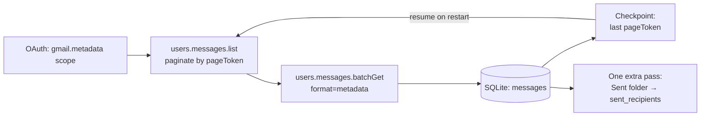
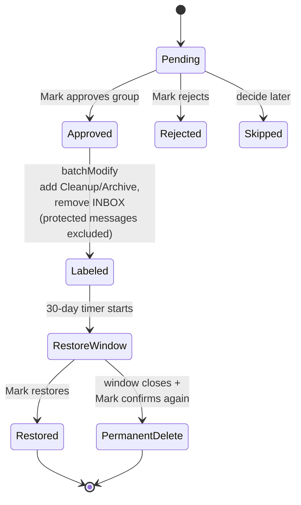

# Gmail Cleanup Strategy — Technical Spec

2026-09-20 · @Someone · v4 (reconciles against the actual Design.html prototype export)

## Overview

Mark's Gmail account holds 412,847 messages (61.2 GB) collected since August 2005, now billed under Google's storage pricing. The goal is a cleanup tool that ranks senders from safest to riskiest to delete and lets Mark approve every batch himself — nothing is ever auto-deleted.

Deletion is also staged, not immediate: an approved batch is labeled and archived first, with a 30-day restore window before anything moves to permanent deletion. Every irreversible action is written to an audit log before it runs, since Gmail itself keeps no record after a permanent delete.

**v1 scope:** a one-time cleanup pass over the existing mailbox. Ongoing/incremental sync (catching mail that arrives after the initial pull) is explicitly out of scope for v1 — see **Future work** at the end.

## Build split

- **Claude Code** owns `extract/`, `score/`, `execute/` — it can authenticate to the Gmail API directly and iterate against Mark's real mailbox, which this chat cannot reach.
- **Codex** owns `review-ui/`, using the four-screen prototype below as a visual reference.
- The two build streams never call each other's code. The SQLite schema in this document is the entire integration contract between them — see **Integration contract**.

## Data schema

Metadata only — never message bodies — pulled once and stored locally in SQLite at `data/gmail_cleanup.db`.

**`messages`**

| Column | Type | Notes |
| --- | --- | --- |
| message\_id | text (PK) | Gmail message id |
| thread\_id | text | groups replies in a thread |
| sender\_email | text | full From address |
| sender\_domain | text | derived, always populated (used for filtering/display even when grouping is by address — see Categorization) |
| subject | text | |
| date | integer | epoch, from the Date header |
| size\_bytes | integer | |
| is\_read | boolean | |
| is\_starred | boolean | |
| has\_attachment | boolean | |
| has\_list\_unsubscribe | boolean | derived from `List-Unsubscribe` / `List-ID` headers — needed by the categorizer |
| labels | text | JSON array of Gmail label ids |
| category | text | copied from `sender_identity.category` for this message's `sender_email` |

**`sender_identity`** — the output of the categorization pipeline, one row per unique `sender_email`. This is the cache that makes classification a one-time cost regardless of how many messages a sender has.

| Column | Type | Notes |
| --- | --- | --- |
| sender\_email | text (PK) | |
| sender\_domain | text | |
| category | text | from the fixed taxonomy (see Scoring model) |
| inferred\_brand | text | normalized display identity used for grouping (e.g. "Delta Air Lines"), see Categorization |
| is\_esp\_routed | boolean | true if `sender_domain` is third-party sending infrastructure rather than the brand's own domain |
| rationale | text | one-line plain-language explanation, surfaced in Group Review as the "why" |
| classification\_source | text | `rule` \| `llm` |
| model\_version | text, nullable | populated when `classification_source = 'llm'` |
| classified\_at | integer | |

**`sender_groups`**

Approvals happen at this level. The grouping key is **not always the domain** — see Categorization & grouping for why.

| Column | Type | Notes |
| --- | --- | --- |
| group\_key | text (PK) | `sender_email`, `sender_domain`, or `inferred_brand`, depending on `group_type` |
| group\_type | text | `address` \| `domain` \| `brand` |
| sender\_domain | text | always populated, even for `address`/`brand`-type groups |
| category | text | for `domain`/`brand`-type groups, the most conservative category among member addresses (see Categorization) |
| message\_count | integer | |
| total\_size\_bytes | integer | |
| first\_seen | integer | |
| last\_seen | integer | |
| avg\_date | integer | epoch average of member messages' `date` — feeds `age_weight` |
| pct\_unread | real | |
| pct\_attachments | real | |
| pct\_starred | real | |
| has\_protected\_label | boolean | true if any member message carries a label in the configured protected-label set (see Config) |
| delete\_safety\_score | real | computed, see Scoring model |
| approval\_status | text | pending / approved / rejected / skipped |

**`run_state`** — extraction checkpoint: last successful `pageToken`, message count, timestamp. Lets a crashed pull resume instead of restarting.

**`batches`** — one row per approved group's execution lifecycle. This is what the review-workflow state diagram actually tracks; `approval_status` above only covers the review phase.

| Column | Type | Notes |
| --- | --- | --- |
| batch\_id | text (PK) | uuid |
| group\_key | text | FK → `sender_groups.group_key` |
| status | text | approved / labeling / labeled / restore\_window / restored / delete\_pending / permanently\_deleted / failed |
| approved\_at | integer | |
| labeled\_at | integer | |
| restore\_deadline | integer | `labeled_at` + 30 days |
| restored\_at | integer, nullable | |
| permanent\_delete\_confirmed\_at | integer, nullable | second, separate confirmation |
| permanently\_deleted\_at | integer, nullable | |
| message\_count | integer | snapshot at approval time |
| total\_size\_bytes | integer | snapshot at approval time |
| window\_extensions | integer, default 0 | count of times Mark pushed out `restore_deadline` — see below |

**Extending the restore window:** the prototype's Progress screen offers "restore or extend the window" per batch, not just restore. `execute/` needs an `extend_window(batch_id, days)` operation that pushes `restore_deadline` forward and increments `window_extensions` — no separate confirmation needed (it only delays an irreversible action, never accelerates one), but log it to `audit_log` for the record.

**`batch_messages`** — per-message execution status, so a crashed `batchModify`/`batchDelete` run resumes without re-processing or double-confirming.

| Column | Type | Notes |
| --- | --- | --- |
| batch\_id | text | FK → `batches.batch_id` |
| message\_id | text | FK → `messages.message_id` |
| status | text | pending / labeled / excluded\_protected / deleted / failed |

`excluded_protected` is a real, expected status (see the starred/protected safeguard below) — it's how the UI explains "approved 500, but 3 were protected and skipped."

**`audit_log`** — durable record of every irreversible action, independent of Gmail (which has no record after a permanent delete).

| Column | Type | Notes |
| --- | --- | --- |
| id | integer (PK, autoincrement) | |
| batch\_id | text | FK → `batches.batch_id` |
| event | text | approved / labeled / restored / window\_extended / permanent\_delete\_confirmed / permanently\_deleted |
| message\_count | integer | how many messages this event touched |
| timestamp | integer | |
| note | text | free text, e.g. the confirmation phrase Mark typed, or "extended +30d" |

## Categorization & identity pipeline

*(v1 didn't define how `category` got assigned at all. v2 added a pure-regex ruleset. v3 keeps the rules — they're free and reliable for the obvious cases — but adds an LLM stage for everything regex genuinely can't do: brand normalization and ambiguous judgment calls.)*

Classification runs **once per unique `sender_email`**, not per message, and is cached in `sender_identity`. At 412k messages the number of *unique senders* is expected to be in the hundreds to low thousands, so this is a one-time, low-volume, offline job — cost and latency are trivial regardless of mailbox size. Every message from that address gets `category` denormalized from its `sender_identity` row.

**Stage 1 — deterministic rules (no API call, no cost).** Evaluated in order, first confident match wins, sets `classification_source = 'rule'`:

1. **Personal correspondence** — `sender_email` is in Mark's Gmail Contacts, OR Mark has sent at least one message *to* that address (see "Two-way correspondence" below).
2. **Business-critical** — `sender_domain`/`sender_email` matches the curated allow-list in config (bank, employer, insurance, medical, tax, legal, government, etc.).
3. **Spam / phishing leftovers** — message currently carries Gmail's own `SPAM` label.
4. **Transactional / receipts** — sender local-part matches `order|receipt|invoice|billing|statement|shipping|confirmation`, or subject matches common transactional templates.
5. **Automated notifications** — sender local-part matches `notify|notification|alert|no-?reply|do-?not-?reply|system|updates` and the message has **no** `List-Unsubscribe`/`List-ID` header.

Anything that doesn't hit a confident rule above — plus, regardless of category confidence, every sender on a domain that isn't a known consumer domain and isn't a pre-approved single-brand org domain (see Grouping below) — falls through to Stage 2, since Stage 1 has no way to determine brand identity.

**Stage 2 — Claude classification (Anthropic API), batched.** For the residual senders, send Claude a compact, metadata-only bundle per sender — email, display name, domain, ~10–20 sample subject lines, header flags, volume/date-range stats, the two-way-correspondence flag — batching many senders (e.g. 20–50) into each request for efficiency. A small, fast model (e.g. Haiku) is the right size for this task; it's classification over short structured text, not open-ended generation. Ask it to return, per sender:
- `category` (must be one of the fixed taxonomy values — validate the response, don't trust free text),
- `inferred_brand` (normalized display identity, for grouping),
- `is_esp_routed` (true if the domain looks like third-party sending infrastructure rather than the brand's own domain),
- `rationale` (one plain-language sentence, shown as the "why" in Group Review).

Sets `classification_source = 'llm'` and `model_version`. **No message bodies are ever sent** — this stays within the same metadata-only boundary as the rest of the pipeline; no OAuth scope change is needed for this step since it doesn't touch Gmail at all.

**Fallback rule (applies to both stages):** if a sender is still ambiguous after both stages, or Stage 2 returns something that fails validation, default to **Personal correspondence** — the non-deletable category. When in doubt, the classifier is wrong in the safe direction, never the aggressive one.

**Hard rails stay outside the model's control.** The LLM proposes `category`/`inferred_brand`/`rationale`; it never gets a vote on the business-critical allow-list, the starred/protected exclusion, or the safe-fallback default — those are enforced in code in `score/`/`execute/` regardless of what Stage 2 returns. A bad classification can produce a wrong label Mark catches in review; it cannot bypass a guardrail.

**Two-way correspondence detection:** rather than querying `in:sent to:<address>` per unique sender (thousands of API calls at this scale), do **one bounded extra pass** over the Sent folder during extraction, building a single `sent_recipients` set of every address Mark has sent To/Cc. Rule 1 checks membership in that set.

**Domain/brand-type group roll-up:** if a group's member addresses span multiple categories, the group's `category` is the **most conservative** (lowest deletion weight) one present — e.g. a company domain with both `billing@acme.com` (Transactional) and a coworker `jane@acme.com` (Personal) rolls up to Personal.

**Required extra metadata fetch:** add `List-Unsubscribe` and `List-ID` to the `metadataHeaders` list pulled during extraction, alongside `From`, `Subject`, `Date`.

## Grouping: address vs. domain vs. brand

*(v1 grouped everything by `sender_domain`, which silently merges unrelated senders sharing a provider or sending platform. v2 fixed the consumer-domain case. v3 adds the third case: legitimate mail routed through third-party sending infrastructure, where the domain isn't the sender's real identity at all.)*

Grouping decision per sender, evaluated in order:

1. **`sender_domain` is a known consumer/free-mail provider** (gmail.com, googlemail.com, yahoo.com, outlook.com, hotmail.com, live.com, msn.com, icloud.com, me.com, aol.com, protonmail.com, gmx.com, …) → `group_type = 'address'`, `group_key = sender_email`. Individuals sharing a mail provider never get bundled together.
2. **`sender_domain` is ESP-routed** — either statically listed in config (Mailchimp, SendGrid, Klaviyo, Constant Contact sending domains, etc.) or `sender_identity.is_esp_routed = true` for its senders — → `group_type = 'brand'`, `group_key = inferred_brand`. This is what makes "Delta Air Lines" group together correctly even if its mail arrives via `t.delta.com`, a Salesforce Marketing Cloud domain, or three different vanity subdomains.
   - **Discovery heuristic, not just a static list:** during aggregation, if a single `sender_domain` shows more than `ESP_DISCOVERY_THRESHOLD` (config, default 5) distinct `inferred_brand` values among its senders, treat that domain as ESP-routed for grouping purposes even if it was never added to the static list. This catches ESPs Mark hasn't manually configured.
3. **Otherwise** → `group_type = 'domain'`, `group_key = sender_domain`. This is the common case for a company or service sending from its own domain — one brand per domain, no LLM-driven override needed.

`sender_domain` stays populated on every `sender_groups` row regardless of `group_type`, so the Dashboard's category/domain filter chips keep working across all three.

## Scoring model

Every sender group gets a 0-100 `delete_safety_score`; higher means safer to delete. Scoring runs at the group level, using `group_key` (address or domain per above), not per message.

**Category weights** (base points out of 40)

| Category | Weight |
| --- | --- |
| Spam / phishing leftovers | 40 |
| Marketing / promotional | 35 |
| Automated notifications | 35 |
| Newsletters / subscriptions | 25 |
| Transactional / receipts | 15 |
| Business-critical | 0 |
| Personal correspondence | 0 |

```python
def delete_safety_score(group):
    score = CATEGORY_WEIGHT[group.category]                       # 0-40
    score += sender_pattern_weight(group)                          # 0-20
    score += age_weight(group)                                     # 0-20
    score -= attachment_penalty(group)                             # 0-20
    score += size_bonus(group)                                     # 0-10
    if group.pct_starred > 0 or group.has_protected_label:
        return 0                                                   # deprioritizes the group; does NOT
                                                                     # bypass the per-message exclusion
                                                                     # enforced at execution time (see below)
    return max(0, min(100, score))

def sender_pattern_weight(group):
    # more weight for high, steady volume and a sender that has gone quiet
    volume = min(group.message_count / 5000, 1) * 12
    dormant = 8 if (TODAY - group.last_seen).days > 365 else 0
    return volume + dormant

def age_weight(group):
    avg_age_years = (TODAY - group.avg_date).days / 365            # avg_date computed at aggregation time
    return min(avg_age_years / 6, 1) * 20

def attachment_penalty(group):
    return group.pct_attachments * 20                              # attachments pull the score down hard

def size_bonus(group):
    # bigger space savings ranks higher for review priority, not deletion itself
    return min(group.total_size_bytes / (2 * 1024**3), 1) * 10
```

`avg_date` and `has_protected_label` are computed during the aggregation pass that builds `sender_groups`:
- `avg_date = AVG(messages.date)` over the group's member messages.
- `has_protected_label = EXISTS` a member message whose `labels` includes an id in the configured `PROTECTED_LABEL_IDS` set (default: `STARRED`, `IMPORTANT`, plus any custom labels Mark adds to config — e.g. "Family", "Legal/Taxes").

**Starred/protected safeguard is enforced twice, independently:**
1. The score hard-override above zeroes the group's score as a visible warning signal in the ranked list.
2. **Regardless of score or approval,** `execute/` filters any message with `is_starred=1` or a protected label out of every `batchModify`/`batchDelete` id list before it runs, marking those rows `excluded_protected` in `batch_messages`. This means a single starred message in an otherwise-legitimate 4,000-message cleanup group no longer has to sink the whole group's score to zero to stay safe — Mark can still approve the group, and the protected message is hard-excluded in code either way. This is defense-in-depth: even a manual override of a zero-scored group can't touch a starred message.

Read/unread status is not scored directly. It is shown alongside the sample messages in the review screen, since its meaning flips by category — unread marketing suggests no engagement, but unread personal mail may mean something was missed.

**UI display labels (from the prototype, use verbatim in review-ui):** the six score components are always shown as bars in this order and under these exact labels, even when a factor contributes zero — "Sender category," "Sender pattern," "Age," "Attachment penalty," "Starred / labeled," "Size bonus." The "Starred / labeled" row is where `has_protected_label`/`pct_starred` surfaces to Mark, distinct from the score's hard-override behavior described above.

## Extraction architecture

A Python script pulls metadata only, in batches, and writes it into the local `messages` table so the whole 412k-message pull can pause and resume without re-fetching what's already stored.



- **Auth & scope:** use `https://www.googleapis.com/auth/gmail.metadata` (read-only, headers and labels only, no body access) for the extraction pass. A separate, later OAuth step re-authenticates with `gmail.modify` only when Mark approves the first batch of label/archive actions. *(v1's diagram and prose disagreed on the scope name — `gmail.metadata` is the one that's actually used; `gmail.readonly` would grant body access we don't want.)*
- **Pagination:** `users.messages.list` returns up to 500 ids per page; batch-fetch each page's metadata with `format=metadata` and `metadataHeaders=[From, Subject, Date, List-Unsubscribe, List-ID]` to avoid downloading bodies and to feed the categorizer.
- **Rate limits:** Gmail's API allows roughly 250 quota units/user/second; batch requests (up to 100 per HTTP call) keep this well under budget even at 412k messages. On `429`/`5xx`, retry with exponential backoff (start 1s, ×2, up to 5 attempts, honor any `Retry-After` header); after exhausting retries, log and skip that page/batch — it's picked up again on the next checkpointed run rather than aborting the whole pull.
- **Checkpointing:** store the last successful `pageToken` and message count in `run_state`; a crashed or interrupted run resumes from there instead of restarting.
- **Sent-folder pass:** one additional bounded pull over the Sent folder (same batchGet mechanics) to build `sent_recipients`, feeding the categorizer's two-way-correspondence rule.
- **Sender grouping:** after the raw pull and categorization pass, one aggregation pass builds `sender_groups` from `messages`, computing the fields the scoring model needs (including `avg_date`, `has_protected_label`, and choosing `group_key`/`group_type` per the domain-vs-address rule above).

## Review workflow

Approvals happen at the sender-group level; execution always follows the same three-step safety pattern, never a direct delete.



- **Label, then archive, then delete:** an approved group is first modified with `users.messages.batchModify` — add a `Cleanup/Archive` label, remove `INBOX` — in chunks of up to 1,000 ids per call (Gmail's per-call cap for both `batchModify` and `batchDelete`). Protected messages are excluded from the id list before chunking (see Scoring model). Nothing is deleted at this step.
- **Restore window:** for 30 days the labeled messages stay in the account, findable by label, and a one-click restore reverses the label change. `batches.restore_deadline` drives this; `batch_messages` tracks per-message status so a crash mid-run resumes only the still-`pending` ids instead of re-labeling or re-confirming anything already done.
- **Permanent delete is not the same as Gmail Trash:** `users.messages.batchDelete` permanently removes messages, bypassing Gmail's own Trash/recovery mechanism entirely — the 30-day label-based restore window above *is* the actual undo mechanism, not a Gmail safety net. Runs only after the window closes, and only with a second explicit confirmation per group (never bundled with the original approval). Every permanent-delete event writes an `audit_log` row (batch id, message count, timestamp, confirmation note) before it executes, since it's the one action with no record left in Gmail afterward.
- **Batch approval UI:** the review screen groups by sender, shows the score breakdown and a sample of real subject lines, and lets Mark approve, reject, or skip each group before it ever reaches the approval queue.

## Integration contract (review-ui ↔ extract/score/execute)

Because Codex and Claude Code are building separate halves independently, the SQLite database at `data/gmail_cleanup.db` is the **entire** interface between them — no REST API, no shared process:

- **review-ui reads:** `sender_groups` (ordered by `delete_safety_score` desc) for the Dashboard; a sample of `messages` for a given `group_key` for Group Review, joined with `sender_identity` for the `rationale` shown as the plain-language "why"; `batches` + `batch_messages` for the Progress screen.
- **review-ui writes:** `sender_groups.approval_status` (+ implicitly creates a `batches` row on approval) when Mark approves/rejects/skips a group; a `restored_at` update when Mark clicks restore within the window; the second confirmation event for permanent delete.
- **execute/ reads:** polls `batches` for rows with `status = 'approved'` and processes them; on completion writes back status transitions into `batches`/`batch_messages` and appends to `audit_log`.
- **execute/ is invoked**, not imported — either run manually by Mark via CLI (`python execute/run.py --dry-run` / `--live`), or shelled out to as a subprocess from review-ui's "Confirm and start archive run" / "Confirm permanent delete" buttons. Either way it's a separate OS process from the UI.
- **Progress screen** is a polling read of `batches`/`batch_messages` (every few seconds is plenty for a single-user local tool) — no websocket or push infrastructure needed.

This lets both build streams proceed against this document without coordinating on anything beyond the schema.

## UI/UX prototype

A four-screen clickable prototype covers the whole flow: [Gmail Cleanup — Review App Prototype](https://claude.ai/artifact/3YbtNZqYmefNKHzXqy9rV6).

| Screen | Shows | Key interaction |
| --- | --- | --- |
| Dashboard | Sender groups ranked by score, with category filter chips (counts per category), message count, size, and active date range | **Multi-select via checkboxes**, with a persistent bottom summary bar (count/messages/size) across the current selection; jump into a group's review |
| Group review | One sender's score breakdown (the six named factors above, each its own bar) plus a sample of real subject lines with read/unread dot and size | Reject, skip, or approve the group |
| Approval queue | The batch about to be actioned — every approved group, total count and size, plain-language explanation of what happens next | Confirm and start the archive run |
| Progress | Per-batch live progress, running totals (GB reclaimed / messages archived / permanently deleted), and a per-group restore countdown | Restore, or **extend the restore window**, for any archived group before its deadline; restore is disabled while a batch is still archiving |

The design deliberately keeps message-level review rare: Mark acts on sender groups, and only drops into individual messages when a group's sample looks ambiguous.

**Business-critical / protected groups are locked at the Dashboard level, not just at execution time:** in the prototype, a Business-critical group's row shows a disabled checkbox and its action button reads "Protected" instead of "Review →" — it can't even be selected into a batch. This is a UI-level guardrail that should mirror the backend hard-exclusion, not just documentation: **review-ui must disable selection for any group whose category is Business-critical or where `has_protected_label` is true**, not merely warn about it after the fact.

**Copy fix needed — this is a real inconsistency in the prototype itself, not a design decision:** the Approval Queue screen's explanatory text says approved groups, after 30 days with no restore, "move to Trash for final removal" — phrasing that reads as automatic. The Progress screen's own footer contradicts this correctly: "Permanent deletion is never automatic — each batch needs its own confirmation after its 30-day window closes." Build review-ui to the Progress screen's version — the Approval Queue copy should be corrected to say the window's end makes the batch *eligible* for permanent deletion, pending Mark's separate confirmation, not that deletion happens on its own.

**Additions needed beyond what the prototype shows:** the Group Review score breakdown should also show the `excluded_protected` count when nonzero ("497 of 500 will be archived — 3 are starred and excluded"), and the Progress screen should distinguish `labeled`/`restore_window`/`permanently_deleted` batch states rather than a single generic "done."

## Config & tunables

A single `config/settings.yaml` (+ `config/allowlists.yaml` for longer lists) read by `extract/`, `score/`, and `execute/`, so none of the following are hardcoded in application logic:

- `CONSUMER_DOMAINS` — the shared/free-mail provider list driving address-vs-domain grouping.
- `KNOWN_ESP_DOMAINS` — statically known third-party sending domains that trigger brand-based grouping.
- `ESP_DISCOVERY_THRESHOLD` — distinct `inferred_brand` count on one domain before it's auto-treated as ESP-routed (default 5).
- `PROTECTED_LABEL_IDS` — labels that trigger the hard-exclusion safeguard (default `STARRED`, `IMPORTANT`, extendable).
- `BUSINESS_CRITICAL_ALLOWLIST` — domains/addresses forced to the Business-critical category regardless of pattern rules or LLM output.
- `ANTHROPIC_MODEL` — model used for Stage 2 categorization (a small/fast model is sufficient — this is short structured-text classification, not generation).
- `BATCH_SIZE_CAP` — max messages processed per `execute/` run (default 5,000), so a bug can't silently process the whole account in one pass.
- `RESTORE_WINDOW_DAYS` — default 30.
- Stage 1 regex patterns (transactional/notification local-part and subject patterns).

`ANTHROPIC_API_KEY` is read from the environment (not committed to config), same convention as the Gmail OAuth credentials.

v1 has no UI for editing these — Mark edits the YAML directly. Config-driven editing from review-ui is a reasonable v2 addition, not required for handoff.

## Handoff notes

Build in this order: extraction, then scoring (including categorization), then the review UI, then execution. Each stage is runnable and checkable on its own before the next depends on it.

```
gmail-cleanup/
  extract/        # Gmail API pull -> SQLite (Data schema, Extraction architecture)
  score/          # categorization pass + delete_safety_score (Categorization pipeline, Scoring model)
  review-ui/      # local app implementing the four screens in the prototype link above
  execute/        # batchModify / batchDelete runner, gated by the approvals table (Review workflow)
  config/         # settings.yaml, allowlists.yaml (Config & tunables)
  data/           # local SQLite file, gitignored
```

**Guardrails to hard-code, not leave to runtime judgment:**

- Label-and-archive before any delete call is ever reachable in code — no path skips straight to `batchDelete`.
- Every batch action requires a stored approval row (`batches.status`) before it runs; the executor refuses to act on an unapproved group.
- Starred/protected messages are excluded from every batch action in code, independent of group approval or score.
- Dry-run mode on by default; a real run needs an explicit flag.
- Cap batch size per run (`BATCH_SIZE_CAP`, default 5,000 messages) so a bug can't silently process the whole account in one pass.
- Permanent deletion requires a second, separate confirmation after the 30-day window, never bundled with the original approval, and always writes an `audit_log` row first.
- Categorization defaults to the safest category (Personal correspondence) whenever neither rules nor the LLM produce a confident, valid match — never guess toward a higher deletion weight.
- The LLM classification stage (`sender_identity`) is advisory only: it can set `category`/`inferred_brand`/`rationale`, but the business-critical allow-list, protected-message exclusion, and safe-fallback default are enforced in code and cannot be overridden by its output.
- No message bodies are ever sent to the Anthropic API — Stage 2 classification uses the same metadata fields already stored locally, nothing more.

## Future work (explicitly out of scope for v1)

- **Incremental sync:** re-running the tool after the initial full pull currently means starting over conceptually (though checkpointing avoids re-fetching already-stored messages). A future pass could use `users.history.list` with a stored `historyId` to pick up only what's arrived since the last run, turning this from a one-time cleanup into an ongoing mailbox-hygiene tool.
- **Config editing from the UI** for allowlists/thresholds instead of hand-editing YAML.
- **History/audit view in review-ui** surfacing `audit_log` for past runs, once there's more than one cleanup cycle to look back on.
